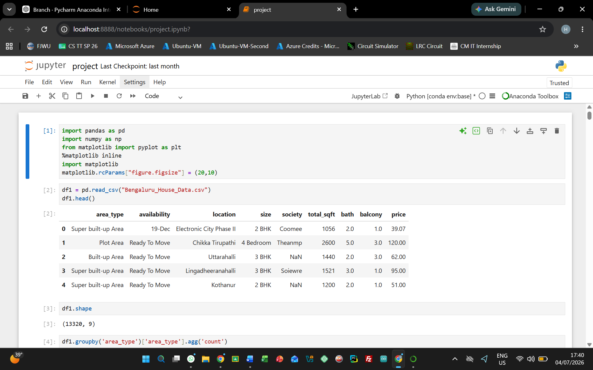
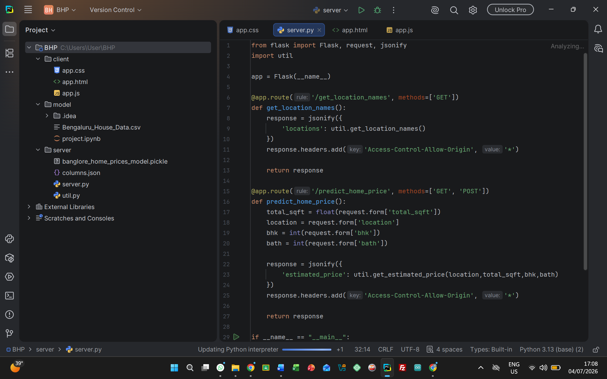
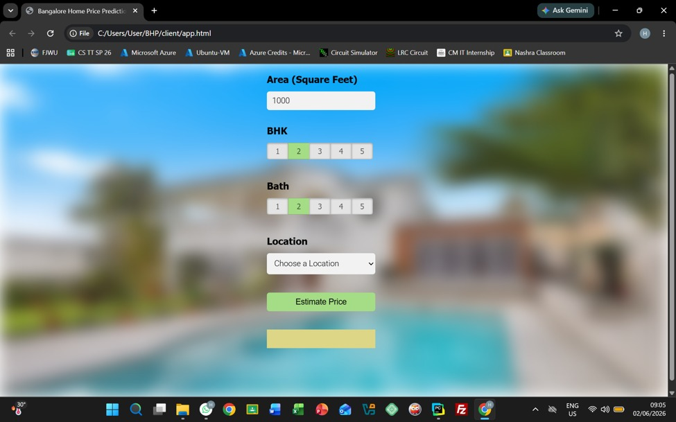

# 🏠 Bangalore House Price Prediction

An end-to-end Machine Learning web application that predicts Bangalore house prices based on:

- 📐 Total Square Feet
- 🛏 Number of Bedrooms (BHK)
- 🛁 Number of Bathrooms
- 📍 Location

The project was built using Python, Machine Learning, Flask, HTML, CSS, and JavaScript.


## 🚀 Features

- Machine Learning model trained on Bangalore housing dataset
- Data preprocessing and feature engineering
- Flask REST API
- Interactive web interface
- Dynamic location dropdown using JSON
- Real-time house price prediction


## 🛠 Technologies Used

- Python
- Jupyter Notebook
- Pandas
- NumPy
- Scikit-learn
- Flask
- HTML
- CSS
- JavaScript


## 📂 Project Structure

```
client/
server/
model/
README.md

```


## 📸 Screenshots







## 📈 Future Improvements

- Deploy online using Render or Railway
- Better UI with Bootstrap or React
- User authentication
- Additional house features
- Interactive charts and analytics
